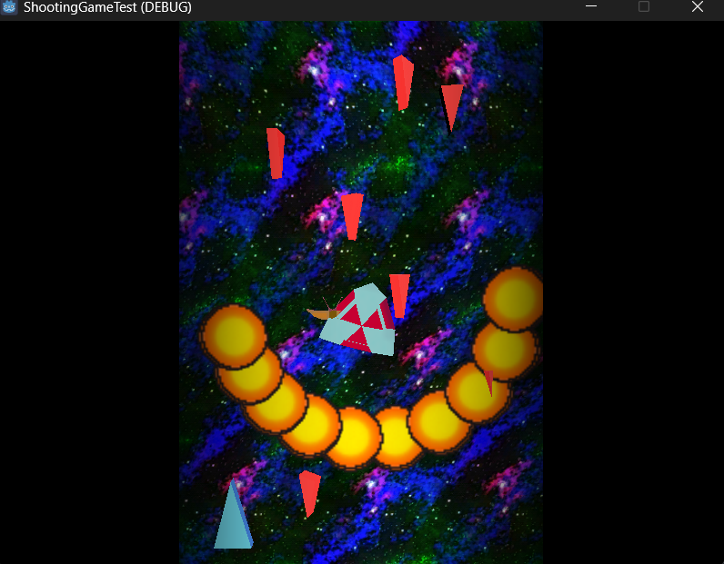

# Shooting Game Test

## Introduction

まだ作成中だよ！
It's under constraction!! (with nostalgia)

### English

This is my introductory commitment of Godot Project. I almost forget how to use git. So the process can be like awkward. Please pardon me about this. I will elaborate to re-learn how to use this.

### 日本語

これは私の最初のGodotゲームのプロジェクトです。Gitの使い方はほとんど忘ちゃいました。ちょっとぎこちないかもしれません。使い方を思い出すために、復習しようとおもいます。

## The Goal

### English

The goal of this repository is as follows:

+ Create Simple 2D Shooting Game 
+ Create Tutorial to create this

Shooting game in two-dimension may be the simplest group of the games. The graphic shall be drawn in 3-dimension space but our world is limited in 2-dimension. This is because I'm not good at drawing DOT characters. 

Fundamentally the programming style is as same as that of 2-dimension. I will comment where is the different things for each GDScripts. 

### 日本語

このリポジトリのゴールは、

+ 簡単な2Dのシューティングゲームを作ること
+ この作り方を文章にまとめること

とします。

このゲームは3Dで描写されます。しかし動きは二次元平面上で行うため、実質2Dゲームのようになります。私はドット絵を描くことが苦手です。だからグラフィックスの部分は3Dを組み合せようとおもいました。3Dグラフィックスは概念を理解するのがちょっとだけ難しいですが、その部分は重点的に説明をしたいとおもっています。できるだけわかりやすくまとめていくつもりです。

## License

I adopt this repsoitory as MIT license. You can free to modify and redistribute. But remember THERE IS NO WARRANTY to use this. 
